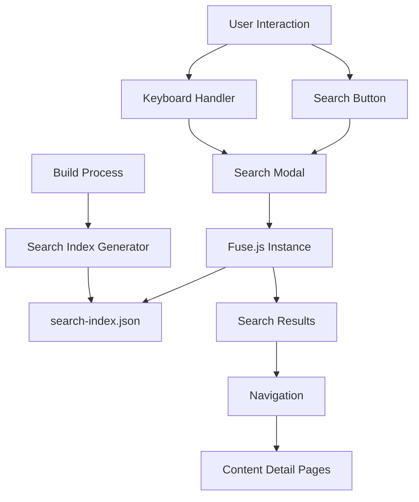

# Design Document

## Overview

The global search feature will provide users with a fast, intuitive way to find content across all libraries in Promptz.dev. The implementation will use a build-time generated search index, client-side fuzzy search with Fuse.js, and a modal interface that replicates the Next.js documentation search experience. The search will be accessible via keyboard shortcuts (CMD+K/CTRL+K) and a prominent search button on the homepage.

## Architecture

The search system consists of three main components:

1. **Build-time Search Index Generator**: Extends the existing build process to create a unified search index
2. **Search Modal Component**: Client-side React component using shadcn dialog with integrated Fuse.js
3. **Global Keyboard Handler**: Application-wide keyboard shortcut listener



## Components and Interfaces

## Components and Interfaces

### Search Index Generator

**Location**: `scripts/build-search-index.ts`

**Purpose**: Generate a unified search index at build time from existing JSON data files, following the same patterns as `generate-library-data.ts`.

```typescript
#!/usr/bin/env tsx

/**
 * Build-time script to generate search index from static JSON data
 * Integrates with existing prebuild process after generate-library-data.ts
 */

import path from 'path'
import fs from 'fs/promises'
import type { 
  Prompt, 
  Agent, 
  Power, 
  SteeringDocument, 
  Hook,
  ContentItem 
} from '../lib/types/content'

const DATA_PATH = path.join(process.cwd(), 'data')
const SEARCH_INDEX_PATH = path.join(DATA_PATH, 'search-index.json')

interface SearchIndexItem {
  id: string
  type: 'prompt' | 'agent' | 'power' | 'steering' | 'hook'
  title: string
  description: string
  content: string
  author: string
  date: string
  library: string
  path: string
  keywords?: string[]
}

interface SearchIndex {
  items: SearchIndexItem[]
  metadata: {
    generatedAt: string
    totalItems: number
    itemsByType: Record<string, number>
  }
}

/**
 * Main function to generate search index
 */
async function buildSearchIndex() {
  console.log('🔍 Starting search index generation...')
  
  try {
    // Read all existing JSON data files
    const [prompts, agents, powers, steering, hooks] = await Promise.allSettled([
      readJsonFile<Prompt[]>('prompts.json'),
      readJsonFile<Agent[]>('agents.json'),
      readJsonFile<Power[]>('powers.json'),
      readJsonFile<SteeringDocument[]>('steering.json'),
      readJsonFile<Hook[]>('hooks.json')
    ])
    
    // Extract successful data, fallback to empty arrays
    const promptsData = prompts.status === 'fulfilled' ? prompts.value : []
    const agentsData = agents.status === 'fulfilled' ? agents.value : []
    const powersData = powers.status === 'fulfilled' ? powers.value : []
    const steeringData = steering.status === 'fulfilled' ? steering.value : []
    const hooksData = hooks.status === 'fulfilled' ? hooks.value : []
    
    // Transform all content to search index items
    const searchItems: SearchIndexItem[] = [
      ...promptsData.map(transformToSearchItem),
      ...agentsData.map(transformToSearchItem),
      ...powersData.map(transformToSearchItem),
      ...steeringData.map(transformToSearchItem),
      ...hooksData.map(transformToSearchItem)
    ].filter(Boolean) // Remove any null/undefined items
    
    // Generate metadata
    const itemsByType = searchItems.reduce((acc, item) => {
      acc[item.type] = (acc[item.type] || 0) + 1
      return acc
    }, {} as Record<string, number>)
    
    const searchIndex: SearchIndex = {
      items: searchItems,
      metadata: {
        generatedAt: new Date().toISOString(),
        totalItems: searchItems.length,
        itemsByType
      }
    }
    
    // Write search index to file
    await fs.writeFile(
      SEARCH_INDEX_PATH, 
      JSON.stringify(searchIndex, null, 2), 
      'utf-8'
    )
    
    console.log(`✅ Generated search index with ${searchItems.length} items`)
    console.log('📊 Items by type:', itemsByType)
    
  } catch (error) {
    console.error('❌ Error generating search index:', error)
    // Create empty search index to prevent build failures
    const emptyIndex: SearchIndex = {
      items: [],
      metadata: {
        generatedAt: new Date().toISOString(),
        totalItems: 0,
        itemsByType: {}
      }
    }
    
    await fs.writeFile(
      SEARCH_INDEX_PATH, 
      JSON.stringify(emptyIndex, null, 2), 
      'utf-8'
    )
    
    console.warn('⚠️  Created empty search index to continue build')
  }
}

/**
 * Read JSON file with error handling
 */
async function readJsonFile<T>(filename: string): Promise<T> {
  const filePath = path.join(DATA_PATH, filename)
  const content = await fs.readFile(filePath, 'utf-8')
  return JSON.parse(content) as T
}

/**
 * Transform content item to search index item
 */
function transformToSearchItem(item: ContentItem): SearchIndexItem {
  return {
    id: item.id,
    type: item.type,
    title: item.title,
    description: item.description || extractDescription(item.content),
    content: truncateContent(item.content, 500),
    author: item.author,
    date: item.date,
    library: extractLibraryName(item.id),
    path: generateDetailPath(item.type, item.id),
    keywords: extractKeywords(item)
  }
}

/**
 * Extract library name from content ID
 */
function extractLibraryName(id: string): string {
  return id.split('/')[0] || 'unknown'
}

/**
 * Extract description from content
 */
function extractDescription(content: string): string {
  // Remove markdown headers and get first meaningful paragraph
  const cleanContent = content
    .replace(/^#+\s+.*$/gm, '') // Remove headers
    .replace(/^\s*$/gm, '') // Remove empty lines
    .trim()
  
  const firstParagraph = cleanContent.split('\n\n')[0] || cleanContent.split('\n')[0] || ''
  
  return firstParagraph.length > 150 
    ? firstParagraph.substring(0, 150) + '...'
    : firstParagraph
}

/**
 * Truncate content for search index
 */
function truncateContent(content: string, maxLength: number): string {
  const cleanContent = content.replace(/#+\s+/g, '').trim()
  return cleanContent.length > maxLength 
    ? cleanContent.substring(0, maxLength) + '...'
    : cleanContent
}

/**
 * Extract keywords from content item
 */
function extractKeywords(item: ContentItem): string[] {
  const keywords: string[] = []
  
  // Add existing keywords if available
  if ('keywords' in item && item.keywords) {
    keywords.push(...item.keywords)
  }
  
  // Extract keywords from content
  const contentWords = item.content
    .toLowerCase()
    .replace(/[^\w\s]/g, ' ')
    .split(/\s+/)
    .filter(word => word.length > 3 && word.length < 20)
    .filter(word => !commonWords.includes(word))
  
  // Add unique content words
  const uniqueWords = [...new Set(contentWords)]
  keywords.push(...uniqueWords.slice(0, 10))
  
  return [...new Set(keywords)].slice(0, 15)
}

/**
 * Generate detail page path for content item
 */
function generateDetailPath(type: string, id: string): string {
  const slug = id.split('/').pop() || ''
  return `/${type}s/${slug}`
}

/**
 * Common words to exclude from keyword extraction
 */
const commonWords = [
  'the', 'and', 'for', 'are', 'but', 'not', 'you', 'all', 'can', 'had', 'her', 'was', 'one', 'our', 'out', 'day', 'get', 'has', 'him', 'his', 'how', 'man', 'new', 'now', 'old', 'see', 'two', 'way', 'who', 'boy', 'did', 'its', 'let', 'put', 'say', 'she', 'too', 'use', 'will', 'with', 'this', 'that', 'have', 'from', 'they', 'know', 'want', 'been', 'good', 'much', 'some', 'time', 'very', 'when', 'come', 'here', 'just', 'like', 'long', 'make', 'many', 'over', 'such', 'take', 'than', 'them', 'well', 'were'
]

// Execute the main function
if (require.main === module) {
  buildSearchIndex()
    .then(() => {
      console.log('🎉 Search index generation completed!')
      process.exit(0)
    })
    .catch((error) => {
      console.error('💥 Fatal error during search index generation:', error)
      console.warn('⚠️  Exiting with success to continue build process')
      process.exit(0)
    })
}
```

**Integration**: Update `package.json` prebuild script:
```json
{
  "scripts": {
    "prebuild": "tsx scripts/generate-library-data.ts && tsx scripts/build-search-index.ts"
  }
}
```

### Search Modal Components

**Main Modal Component**: `components/search/SearchModal.tsx`

```typescript
'use client'

import React, { useState, useEffect, useRef } from 'react'
import { useRouter } from 'next/navigation'
import { SearchIcon } from 'lucide-react'
import Fuse from 'fuse.js'
import {
  Dialog,
  DialogContent,
} from '@/components/ui/dialog'
import {
  InputGroup,
  InputGroupAddon,
  InputGroupInput,
} from '@/components/ui/input-group'
import { Badge } from '@/components/ui/badge'
import { Kbd, KbdGroup } from '@/components/ui/kbd'
import { useSearch } from '@/components/search-provider'
import type { SearchIndexItem } from '@/lib/types/content'

export function SearchModal() {
  const { isOpen, closeSearch } = useSearch()
  const router = useRouter()
  const [query, setQuery] = useState('')
  const [results, setResults] = useState<Fuse.FuseResult<SearchIndexItem>[]>([])
  const [selectedIndex, setSelectedIndex] = useState(0)
  const [fuse, setFuse] = useState<Fuse<SearchIndexItem> | null>(null)
  const inputRef = useRef<HTMLInputElement>(null)
  
  // Initialize Fuse.js when modal opens
  useEffect(() => {
    if (isOpen && !fuse) {
      initializeFuse()
    }
  }, [isOpen, fuse])
  
  // Focus input when modal opens
  useEffect(() => {
    if (isOpen) {
      const timer = setTimeout(() => {
        inputRef.current?.focus()
      }, 100)
      return () => clearTimeout(timer)
    }
  }, [isOpen])
  
  // Search when query changes
  useEffect(() => {
    if (!fuse || !query.trim()) {
      setResults([])
      setSelectedIndex(0)
      return
    }
    
    const searchResults = fuse.search(query, { limit: 10 })
    setResults(searchResults)
    setSelectedIndex(0)
  }, [query, fuse])
  
  const initializeFuse = async () => {
    try {
      const searchIndexData = await import('@/data/search-index.json')
      const index = searchIndexData.default.items as SearchIndexItem[]
      
      const fuseOptions = {
        keys: [
          { name: 'title', weight: 0.4 },
          { name: 'description', weight: 0.3 },
          { name: 'content', weight: 0.2 },
          { name: 'keywords', weight: 0.1 }
        ],
        threshold: 0.4,
        includeScore: true,
        includeMatches: true,
        minMatchCharLength: 2,
        ignoreLocation: true
      }
      
      setFuse(new Fuse(index, fuseOptions))
    } catch (error) {
      console.error('Error loading search index:', error)
    }
  }
  
  const handleKeyDown = (event: React.KeyboardEvent) => {
    switch (event.key) {
      case 'ArrowDown':
        event.preventDefault()
        setSelectedIndex(prev => 
          prev < results.length - 1 ? prev + 1 : prev
        )
        break
      case 'ArrowUp':
        event.preventDefault()
        setSelectedIndex(prev => prev > 0 ? prev - 1 : prev)
        break
      case 'Enter':
        event.preventDefault()
        if (results[selectedIndex]) {
          handleResultSelect(results[selectedIndex])
        }
        break
    }
  }
  
  const handleResultSelect = (result: Fuse.FuseResult<SearchIndexItem>) => {
    const path = `/${result.item.type}s/${result.item.id.split('/').pop()}`
    closeSearch()
    router.push(path)
  }
  
  const contentTypeConfig = {
    prompt: { badge: 'Prompt', color: 'blue' },
    agent: { badge: 'Agent', color: 'green' },
    power: { badge: 'Power', color: 'purple' },
    steering: { badge: 'Steering', color: 'orange' },
    hook: { badge: 'Hook', color: 'red' }
  }
  
  return (
    <Dialog open={isOpen} onOpenChange={closeSearch}>
      <DialogContent 
        className="max-w-2xl max-h-[80vh] p-0 gap-0"
        showCloseButton={false}
      >
        {/* Search Input */}
        <div className="p-4 pb-0">
          <InputGroup>
            <InputGroupInput
              ref={inputRef}
              placeholder="What are you searching for?"
              value={query}
              onChange={(e) => setQuery(e.target.value)}
              onKeyDown={handleKeyDown}
              className="text-base border-0 shadow-none focus-visible:ring-0"
            />
            <InputGroupAddon>
              <SearchIcon className="h-4 w-4" />
            </InputGroupAddon>
            <InputGroupAddon align="inline-end">
              <KbdGroup>
                <Kbd>⌘</Kbd>
                <Kbd>K</Kbd>
              </KbdGroup>
            </InputGroupAddon>
          </InputGroup>
        </div>
        
        {/* Search Results */}
        <div className="flex-1 overflow-hidden">
          {!query.trim() ? (
            <div className="p-8 text-center text-muted-foreground text-sm">
              Start typing to search across all libraries...
            </div>
          ) : results.length === 0 ? (
            <div className="p-8 text-center">
              <div className="text-muted-foreground text-sm mb-2">
                No results found for "{query}"
              </div>
              <div className="text-xs text-muted-foreground">
                Try different keywords or check spelling
              </div>
            </div>
          ) : (
            <div className="max-h-96 overflow-y-auto">
              {results.map((result, index) => {
                const config = contentTypeConfig[result.item.type] || { badge: 'Content', color: 'gray' }
                
                return (
                  <div
                    key={result.item.id}
                    className={`p-3 cursor-pointer border-b border-border last:border-b-0 transition-colors ${
                      index === selectedIndex ? 'bg-muted' : 'hover:bg-muted/50'
                    }`}
                    onClick={() => handleResultSelect(result)}
                  >
                    <div className="flex items-start gap-3">
                      <Badge variant="secondary" className="mt-0.5 shrink-0">
                        {config.badge}
                      </Badge>
                      
                      <div className="flex-1 min-w-0">
                        <h3 className="font-medium text-sm truncate mb-1">
                          {result.item.title}
                        </h3>
                        
                        <p className="text-xs text-muted-foreground line-clamp-2 mb-2">
                          {result.item.description}
                        </p>
                        
                        <div className="flex items-center gap-2">
                          <Badge variant="outline" className="text-xs">
                            {result.item.library}
                          </Badge>
                          <span className="text-xs text-muted-foreground">
                            by {result.item.author}
                          </span>
                        </div>
                      </div>
                    </div>
                  </div>
                )
              })}
            </div>
          )}
        </div>
        
        {/* Footer with keyboard shortcuts */}
        <div className="p-3 border-t border-border bg-muted/30">
          <div className="flex items-center justify-between text-xs text-muted-foreground">
            <div className="flex items-center gap-4">
              <div className="flex items-center gap-1">
                <KbdGroup>
                  <Kbd>↑</Kbd>
                  <Kbd>↓</Kbd>
                </KbdGroup>
                <span>Navigate</span>
              </div>
              <div className="flex items-center gap-1">
                <Kbd>↵</Kbd>
                <span>Select</span>
              </div>
            </div>
            <div className="flex items-center gap-1">
              <Kbd>Esc</Kbd>
              <span>Close</span>
            </div>
          </div>
        </div>
      </DialogContent>
    </Dialog>
  )
}
```

### Search Service

**Location**: `components/search-provider.tsx`

**Purpose**: Provide global keyboard shortcut handling and search modal state management using Next.js 16 App Router patterns.

```typescript
'use client'

import React, { createContext, useContext, useState, useEffect } from 'react'

interface SearchContextValue {
  isOpen: boolean
  openSearch: () => void
  closeSearch: () => void
}

const SearchContext = createContext<SearchContextValue | undefined>(undefined)

export function useSearch() {
  const context = useContext(SearchContext)
  if (context === undefined) {
    throw new Error('useSearch must be used within a SearchProvider')
  }
  return context
}

interface SearchProviderProps {
  children: React.ReactNode
}

export function SearchProvider({ children }: SearchProviderProps) {
  const [isOpen, setIsOpen] = useState(false)
  
  const openSearch = () => setIsOpen(true)
  const closeSearch = () => setIsOpen(false)
  
  useEffect(() => {
    const handleKeyDown = (event: KeyboardEvent) => {
      // CMD+K on Mac, CTRL+K on Windows/Linux
      if ((event.metaKey || event.ctrlKey) && event.key === 'k') {
        event.preventDefault()
        openSearch()
      }
      
      // ESC to close when modal is open
      if (event.key === 'Escape' && isOpen) {
        closeSearch()
      }
    }
    
    document.addEventListener('keydown', handleKeyDown)
    return () => document.removeEventListener('keydown', handleKeyDown)
  }, [isOpen])
  
  // Prevent body scroll when modal is open
  useEffect(() => {
    if (isOpen) {
      document.body.style.overflow = 'hidden'
    } else {
      document.body.style.overflow = 'unset'
    }
    
    return () => {
      document.body.style.overflow = 'unset'
    }
  }, [isOpen])
  
  const value = {
    isOpen,
    openSearch,
    closeSearch
  }
  
  return (
    <SearchContext.Provider value={value}>
      {children}
    </SearchContext.Provider>
  )
}
```

**Integration**: Wrap the entire application in `app/layout.tsx` following Next.js 16 context provider patterns:

```typescript
import { SearchProvider } from '@/components/search-provider'
import { SearchModal } from '@/components/search/SearchModal'

export default function RootLayout({
  children,
}: {
  children: React.ReactNode
}) {
  return (
    <html lang="en">
      <body className={`${geistSans.variable} ${geistMono.variable} ${jetbrainsMono.variable} antialiased`}>
        <SearchProvider>
          {children}
          <SearchModal />
        </SearchProvider>
      </body>
    </html>
  )
}
```

### Search Button Component

**Location**: `components/search-button.tsx`

**Purpose**: Prominent search activation button for the homepage following Next.js 16 patterns.

```typescript
'use client'

import { SearchIcon } from 'lucide-react'
import { Button } from '@/components/ui/button'
import {
  InputGroup,
  InputGroupAddon,
  InputGroupInput,
} from '@/components/ui/input-group'
import { Kbd } from '@/components/ui/kbd'
import { useSearch } from '@/components/search-provider'

interface SearchButtonProps {
  className?: string
  variant?: 'default' | 'outline'
}

export function SearchButton({ className, variant = 'default' }: SearchButtonProps) {
  const { openSearch } = useSearch()
  
  return (
    <Button
      variant={variant}
      onClick={openSearch}
      className={className}
    >
      <SearchIcon className="h-4 w-4 mr-2" />
      Search library...
      <Kbd className="ml-auto">⌘K</Kbd>
    </Button>
  )
}
```

**Integration**: Add to homepage in the header section:

```typescript
// app/page.tsx
import { SearchButton } from '@/components/search-button'

export default function Home() {
  return (
    <div className="min-h-screen bg-zinc-50 font-sans dark:bg-black">
      <main className="container mx-auto max-w-7xl px-6 py-16">
        {/* Header Section */}
        <div className="flex flex-col items-center text-center mb-16">
          {/* ... existing header content ... */}
          
          {/* Search Button */}
          <div className="w-full max-w-md mb-8">
            <SearchButton />
          </div>
          
          {/* ... existing buttons ... */}
        </div>
        
        {/* ... rest of the page ... */}
      </main>
    </div>
  )
}
```

## Data Models

### Search Index Structure

The search index will be generated from existing JSON files with the following transformation following the established patterns:

```typescript
// lib/types/content.ts - Add to existing types
export interface SearchIndexItem {
  id: string
  type: 'prompt' | 'agent' | 'power' | 'steering' | 'hook'
  title: string
  description: string
  content: string
  author: string
  date: string
  library: string
  path: string
  keywords?: string[]
}

export interface SearchIndex {
  items: SearchIndexItem[]
  metadata: {
    generatedAt: string
    totalItems: number
    itemsByType: Record<string, number>
  }
}
```

**Transformation Logic**:
```typescript
// scripts/build-search-index.ts
const transformToSearchItem = (item: ContentItem): SearchIndexItem => ({
  id: item.id,
  type: item.type,
  title: item.title,
  description: item.description || extractDescription(item.content),
  content: truncateContent(item.content, 500), // First 500 chars for search
  author: item.author,
  date: item.date,
  library: extractLibraryName(item.id), // e.g., "kiro-powers", "promptz"
  path: generateDetailPath(item.type, item.id),
  keywords: item.keywords || extractKeywords(item.content)
})

// Helper functions
const extractLibraryName = (id: string): string => {
  return id.split('/')[0] || 'unknown'
}

const extractDescription = (content: string): string => {
  // Extract first paragraph or first 150 characters
  const firstParagraph = content.split('\n\n')[0]
  return firstParagraph.length > 150 
    ? firstParagraph.substring(0, 150) + '...'
    : firstParagraph
}

const truncateContent = (content: string, maxLength: number): string => {
  return content.length > maxLength 
    ? content.substring(0, maxLength) + '...'
    : content
}

const extractKeywords = (content: string): string[] => {
  // Simple keyword extraction from content
  const words = content.toLowerCase()
    .replace(/[^\w\s]/g, ' ')
    .split(/\s+/)
    .filter(word => word.length > 3)
  
  // Return unique words, limited to 10
  return [...new Set(words)].slice(0, 10)
}

const generateDetailPath = (type: string, id: string): string => {
  const slug = id.split('/').pop() || ''
  return `/${type}s/${slug}`
}
```

### Content Type Mapping

```typescript
const contentTypeConfig = {
  prompt: {
    icon: 'FileText',
    badge: 'Prompt',
    color: 'blue'
  },
  agent: {
    icon: 'Bot',
    badge: 'Agent', 
    color: 'green'
  },
  power: {
    icon: 'Zap',
    badge: 'Power',
    color: 'purple'
  },
  steering: {
    icon: 'Navigation',
    badge: 'Steering',
    color: 'orange'
  },
  hook: {
    icon: 'GitBranch',
    badge: 'Hook',
    color: 'red'
  }
}
```

## Correctness Properties

*A property is a characteristic or behavior that should hold true across all valid executions of a system-essentially, a formal statement about what the system should do. Properties serve as the bridge between human-readable specifications and machine-verifiable correctness guarantees.*

<function_calls>
<invoke name="prework">
<parameter name="featureName">global-search

### Property Reflection

After reviewing the prework analysis, I identified several areas where properties can be consolidated:

**Redundancy Analysis:**
- Properties 5.2 and 5.3 (arrow key navigation) can be combined into a single comprehensive navigation property
- Properties 4.1, 4.2, and 4.3 (result display elements) can be combined into a comprehensive result display property
- Properties 8.1-8.5 (content type inclusion) can be combined into a single comprehensive content coverage property
- Properties 9.2, 9.3, 9.6, and 9.7 (accessibility features) can be combined into a comprehensive accessibility property

**Unique Properties Retained:**
- Modal activation and closing behaviors (keyboard shortcuts, clicks, escape)
- Search functionality (real-time, fuzzy matching, debouncing)
- Navigation and result interaction
- Performance characteristics
- Error handling behaviors

### Converting EARS to Properties

Based on the prework analysis, here are the key correctness properties:

**Property 1: Modal activation responds to input events**
*For any* keyboard shortcut (CMD+K, CTRL+K) or search button click, the search modal should open immediately and focus the search input
**Validates: Requirements 1.1, 1.2, 1.6**

**Property 2: Modal closing responds to dismissal actions**
*For any* dismissal action (ESC key, backdrop click), the search modal should close and restore previous focus state
**Validates: Requirements 1.3, 1.4**

**Property 3: Search executes in real-time without explicit triggers**
*For any* text input in the search field, results should appear automatically without requiring button clicks or enter key presses
**Validates: Requirements 3.1, 3.2**

**Property 4: Fuzzy search finds approximate matches**
*For any* search query with typos or partial matches, the search should return relevant results using fuzzy matching algorithms
**Validates: Requirements 3.5, 3.6**

**Property 5: Search input is debounced for performance**
*For any* rapid typing sequence, the search should debounce input to avoid excessive processing while maintaining responsiveness
**Validates: Requirements 3.7**

**Property 6: Search results display comprehensive information**
*For any* search result, the display should include content type indicator, title, and library source information
**Validates: Requirements 4.1, 4.2, 4.3, 4.7**

**Property 7: Result highlighting shows matched text**
*For any* search query that matches text within titles, the matched portions should be visually highlighted in the results
**Validates: Requirements 4.5**

**Property 8: Keyboard navigation moves through results**
*For any* arrow key press when results are displayed, the highlight should move to the next/previous result appropriately
**Validates: Requirements 5.1, 5.2, 5.3, 5.7**

**Property 9: Result selection triggers navigation**
*For any* result selection (click or enter key), the modal should close and navigate to the content's detail page
**Validates: Requirements 5.4, 5.5, 5.6**

**Property 10: Search index includes all content types**
*For any* content item from the five supported types (prompts, agents, powers, steering, hooks), it should be included in the search index with complete metadata
**Validates: Requirements 6.2, 6.3, 6.6, 8.1, 8.2, 8.3, 8.4, 8.5**

**Property 11: Search covers multiple content fields**
*For any* search term that appears in title, description, content, or keywords fields, the item should be returned in search results
**Validates: Requirements 8.6**

**Property 12: Search maintains data integrity**
*For any* search result, the library source attribution and metadata should be preserved accurately from the original content
**Validates: Requirements 8.7**

**Property 13: Search handles incomplete data gracefully**
*For any* content item with missing or incomplete metadata, the search should handle it gracefully without breaking functionality
**Validates: Requirements 8.8**

## Error Handling

The search system implements comprehensive error handling at multiple levels:

### Index Loading Errors
- **Network failures**: Display user-friendly error message
- **Malformed data**: Gracefully skip corrupted entries and continue with valid data
- **Missing files**: Create empty search index to prevent build failures

### Search Processing Errors
- **Fuse.js initialization failures**: Continue with empty results and log error
- **Query processing errors**: Log errors and display "Search temporarily unavailable"

### User Experience Errors
- **Empty results**: Display "No results found" with suggested alternatives
- **Partial failures**: Continue functioning with available data

### Error Recovery Strategies
```typescript
const errorRecovery = {
  indexLoadFailure: () => createEmptyIndex(),
  searchTimeout: () => returnEmptyResults(),
  partialDataFailure: () => continueWithAvailableData()
}
```

## Testing Strategy

The search feature will use a dual testing approach combining unit tests and property-based tests:

### Unit Tests
Unit tests will focus on specific examples, edge cases, and integration points:

- **Component rendering**: Verify modal renders with correct elements and styling
- **Event handling**: Test specific keyboard shortcuts and click events
- **State management**: Test modal open/close state transitions
- **Error conditions**: Test specific error scenarios (network failures, malformed data)
- **Integration**: Test search functionality with Fuse.js and index loading

### Property-Based Tests
Property-based tests will verify universal properties across all inputs using fast-check:

- **Search functionality**: Generate random queries and verify results are relevant and properly formatted
- **Keyboard navigation**: Generate random navigation sequences and verify highlight state consistency
- **Data integrity**: Generate random content items and verify search index preserves all required fields

### Testing Configuration
- **Property tests**: Minimum 100 iterations per test for comprehensive coverage
- **Test tags**: Each property test references its design document property
- **Tag format**: `Feature: global-search, Property {number}: {property_text}`
- **Framework**: Jest with React Testing Library for components, fast-check for property tests

### Example Property Test Structure
```typescript
describe('Global Search Properties', () => {
  it('Property 1: Modal activation responds to input events', async () => {
    // Feature: global-search, Property 1: Modal activation responds to input events
    await fc.assert(fc.asyncProperty(
      fc.constantFrom('cmd+k', 'ctrl+k', 'button-click'),
      async (activationMethod) => {
        // Test implementation
      }
    ), { numRuns: 100 })
  })
})
```

This simplified testing strategy ensures both specific functionality works correctly (unit tests) and universal properties hold across all possible inputs (property tests), providing confidence in the search feature's reliability and correctness.