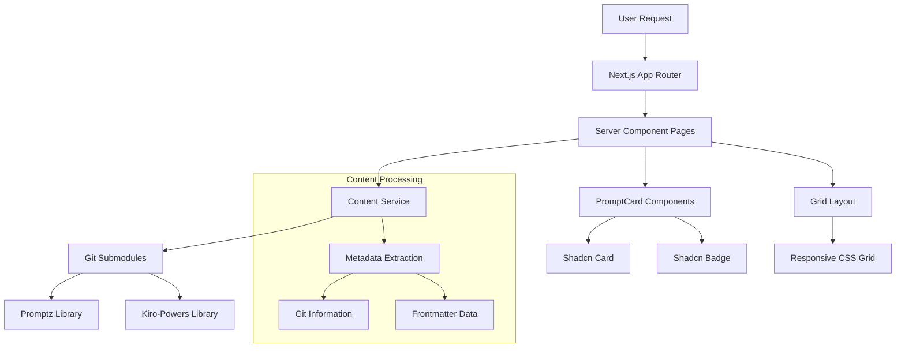
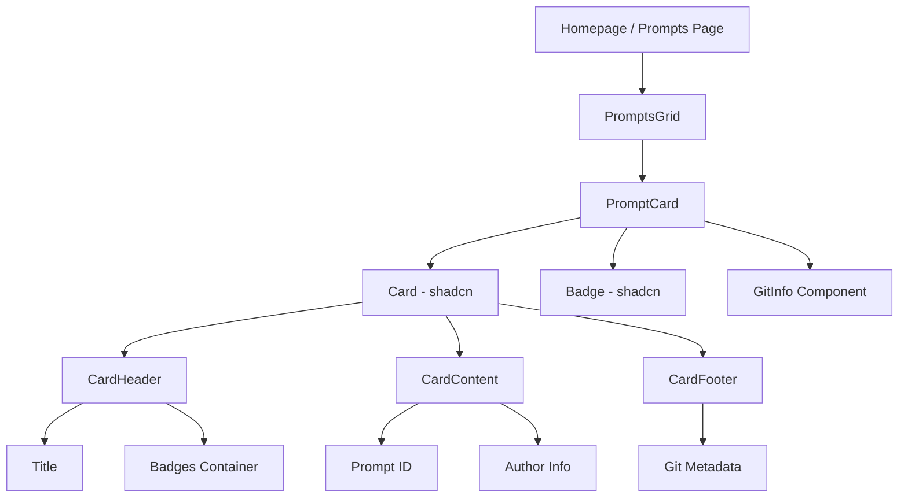

# Design Document

## Overview

This document outlines the design for implementing prompt card rendering functionality on the promptz.dev website. The solution leverages Next.js 16 Server Components, the existing content service architecture, and shadcn/ui components to create a performant, SEO-friendly prompt browsing experience.

The design focuses on server-side rendering for optimal performance, responsive grid layouts for cross-device compatibility, and integration with the existing git-based content management system.

## Architecture

### High-Level Architecture



### Component Hierarchy



## Components and Interfaces

### PromptCard Component

**Purpose**: Display individual prompt information in a consistent card format using shadcn components.

**Props Interface**:
```typescript
import type { Prompt, GitInfo } from '@/lib/types/content'

interface PromptCardProps {
  prompt: Prompt
  className?: string
}

// Uses existing types from lib/types/content.ts:
// - Prompt extends BaseContent with type: 'prompt', content: string, category?: string
// - GitInfo contains author, authorEmail, createdDate, lastModifiedDate, commitHash, commitMessage
```

**Component Structure**:
- Uses shadcn `Card` as the foundation
- `CardHeader` contains title and badges
- `CardContent` displays prompt ID and author information
- `CardFooter` shows git metadata when available
- Responsive design with consistent spacing

### PromptsGrid Component

**Purpose**: Render a collection of prompts in a responsive grid layout.

**Props Interface**:
```typescript
import type { Prompt } from '@/lib/types/content'

interface PromptsGridProps {
  prompts: Prompt[]
  maxItems?: number
  className?: string
}
```

**Features**:
- CSS Grid layout with responsive breakpoints
- Equal height cards using `grid-auto-rows: 1fr`
- Consistent spacing with gap utilities
- Empty state handling

### GitInfo Component

**Purpose**: Display git metadata with proper formatting and fallbacks.

**Props Interface**:
```typescript
import type { GitInfo } from '@/lib/types/content'

interface GitInfoProps {
  git?: GitInfo
  fallbackAuthor: string
  fallbackDate: string
}
```

**Features**:
- Displays git author, creation date, and short commit hash
- Falls back to frontmatter data when git info unavailable
- Consistent date formatting across all cards
- Monospace font for commit hashes

## Data Models

### Content Service Integration

The design leverages the existing content service architecture and type definitions:

```typescript
import { readPromptzLibrary, readKiroLibrary } from '@/lib/content-service'
import type { Prompt, Library } from '@/lib/types/content'

// Existing service functions to be used
const promptzLibrary: Library = await readPromptzLibrary()
const kiroLibrary: Library = await readKiroLibrary()

// Combine prompts from all libraries using existing Prompt type
const allPrompts: Prompt[] = [
  ...promptzLibrary.prompts,
  ...kiroLibrary.prompts
]

// Sort by creation date (newest first) using existing git metadata
const sortedPrompts = allPrompts.sort((a, b) => {
  const dateA = a.git?.createdDate || a.date
  const dateB = b.git?.createdDate || b.date
  return new Date(dateB).getTime() - new Date(dateA).getTime()
})
```

### Data Flow

1. **Server Component** calls content service functions
2. **Content Service** reads from git submodules using existing utilities
3. **Metadata Extraction** processes frontmatter and git information
4. **Data Transformation** sorts and filters prompts as needed
5. **Component Rendering** passes data to PromptCard components

## Correctness Properties

*A property is a characteristic or behavior that should hold true across all valid executions of a system-essentially, a formal statement about what the system should do. Properties serve as the bridge between human-readable specifications and machine-verifiable correctness guarantees.*

Now I'll analyze the acceptance criteria to determine which are testable as properties:

### Property Reflection

After analyzing all acceptance criteria, I identified several areas of redundancy that can be consolidated:

**Redundant Properties Identified:**
- Properties 1.2 and 2.2 (PromptCard component usage) → Can be combined into one comprehensive property
- Properties 1.3 and 2.3 (responsive grid layout) → Can be combined into one comprehensive property  
- Properties 1.4 and 2.4 (empty state handling) → Can be combined into one comprehensive property
- Properties 3.6 and 7.1 (git author display) → Duplicate, remove one
- Properties 3.9 and 7.4 (fallback behavior) → Duplicate, remove one
- Properties 1.5 and 2.5 (sorting behavior) → Can be combined into one comprehensive property
- Properties 6.1 and 3.4 (prompt type badge) → Duplicate, remove one
- Properties 6.2 and 3.5 (library source badge) → Duplicate, remove one

**Consolidation Strategy:**
- Combine page-specific properties (homepage vs prompts page) into universal properties
- Merge duplicate git information properties
- Consolidate badge-related properties
- Create comprehensive properties that cover multiple related behaviors

### Correctness Properties

Based on the prework analysis and property reflection, here are the consolidated correctness properties:

**Property 1: Homepage Prompt Limiting**
*For any* collection of prompts, when rendering the homepage, the system should display exactly 6 prompts sorted by creation date (newest first)
**Validates: Requirements 1.1, 1.5**

**Property 2: Complete Prompt Display**
*For any* collection of prompts, when rendering the prompts page, the system should display all available prompts from all libraries sorted by creation date (newest first)
**Validates: Requirements 2.1, 2.5, 5.3**

**Property 3: Component Consistency**
*For any* prompt rendering context (homepage or prompts page), all prompts should be rendered using the PromptCard component
**Validates: Requirements 1.2, 2.2**

**Property 4: Responsive Grid Layout**
*For any* collection of prompts, the grid layout should apply appropriate responsive classes: single column on mobile, two columns on tablet, three columns on desktop
**Validates: Requirements 1.3, 2.3, 4.1, 4.2, 4.3, 4.4, 4.5**

**Property 5: Empty State Handling**
*For any* empty prompt collection, the system should display an appropriate empty state message instead of an empty grid
**Validates: Requirements 1.4, 2.4**

**Property 6: PromptCard Content Display**
*For any* prompt, the PromptCard should display the title, ID, prompt type badge, and library source badge using shadcn components
**Validates: Requirements 3.1, 3.2, 3.3, 3.4, 3.5, 6.1, 6.2, 6.3**

**Property 7: Git Information Display**
*For any* prompt with git information, the PromptCard should display git author, creation date, and short commit hash (first 7 characters)
**Validates: Requirements 3.6, 3.7, 3.8, 7.1, 7.2, 7.3**

**Property 8: Fallback Information Display**
*For any* prompt without git information, the PromptCard should display author and date from frontmatter metadata
**Validates: Requirements 3.9, 7.4**

**Property 9: Badge Styling Consistency**
*For any* collection of prompt cards, all badges should use consistent shadcn Badge components with appropriate variants and styling
**Validates: Requirements 6.3, 6.4, 6.5**

**Property 10: Date Formatting Consistency**
*For any* collection of prompts, all displayed dates should use the same readable format regardless of source (git or frontmatter)
**Validates: Requirements 7.2, 7.5**

**Property 11: Content Service Integration**
*For any* prompt fetching operation, the system should use the existing readPromptzLibrary and readKiroLibrary functions with React cache optimization
**Validates: Requirements 5.1, 5.2, 5.5**

**Property 12: Error Handling Resilience**
*For any* content service error, the system should handle it gracefully without breaking the page rendering
**Validates: Requirements 5.4, 8.5**

**Property 13: Server-Side Rendering**
*For any* prompt page, the system should render using Next.js Server Components with proper async data fetching and SEO-friendly HTML structure
**Validates: Requirements 8.1, 8.2, 8.3, 8.4**

## Error Handling

### Content Service Errors
- **Missing Libraries**: Display empty state when git submodules are not initialized
- **Corrupted Metadata**: Skip invalid prompts and continue processing valid ones
- **Git Information Unavailable**: Fall back to frontmatter metadata gracefully
- **Network Timeouts**: Use cached data when available, show error state otherwise

### Component Errors
- **Missing Props**: Provide sensible defaults for optional props
- **Invalid Data**: Validate prompt data structure before rendering
- **Rendering Failures**: Use React Error Boundaries to prevent page crashes

### Error Boundaries
```typescript
// Error boundary for prompt grid sections
<ErrorBoundary fallback={<EmptyState message="Unable to load prompts" />}>
  <PromptsGrid prompts={prompts} />
</ErrorBoundary>
```

## Testing Strategy

### Dual Testing Approach
The testing strategy combines unit tests for specific examples and edge cases with property-based tests for universal correctness validation:

**Unit Tests**:
- Specific examples of prompt card rendering with known data
- Edge cases like empty prompt collections
- Error conditions and fallback behavior
- Integration points between components
- Responsive breakpoint behavior with specific viewport sizes

**Property-Based Tests**:
- Universal properties that hold for all valid inputs
- Comprehensive input coverage through randomization
- Validation of correctness properties across many generated scenarios
- Each property test runs minimum 100 iterations for thorough coverage

### Property-Based Testing Configuration
- **Testing Library**: Use `@fast-check/jest` for TypeScript property-based testing
- **Test Configuration**: Minimum 100 iterations per property test
- **Test Tagging**: Each property test references its design document property
- **Tag Format**: `Feature: prompt-cards, Property {number}: {property_text}`

### Testing Implementation Requirements
- Each correctness property must be implemented by a single property-based test
- Property tests should generate realistic prompt data with varied metadata
- Unit tests should focus on specific examples and integration scenarios
- All tests should validate both happy path and error conditions
- Tests should verify responsive behavior across different viewport sizes

### Example Property Test Structure
```typescript
// Feature: prompt-cards, Property 1: Homepage Prompt Limiting
test('homepage displays exactly 6 most recent prompts', () => {
  fc.assert(fc.property(
    fc.array(promptGenerator(), { minLength: 0, maxLength: 20 }),
    (prompts) => {
      const result = renderHomepage(prompts)
      const displayedPrompts = result.getDisplayedPrompts()
      
      if (prompts.length === 0) {
        expect(displayedPrompts).toHaveLength(0)
      } else {
        expect(displayedPrompts).toHaveLength(Math.min(6, prompts.length))
        // Verify sorting by creation date
        const sortedExpected = prompts
          .sort((a, b) => new Date(b.createdDate) - new Date(a.createdDate))
          .slice(0, 6)
        expect(displayedPrompts).toEqual(sortedExpected)
      }
    }
  ))
})
```

This comprehensive testing approach ensures both specific functionality works correctly and universal properties hold across all possible inputs, providing confidence in the system's correctness and reliability.