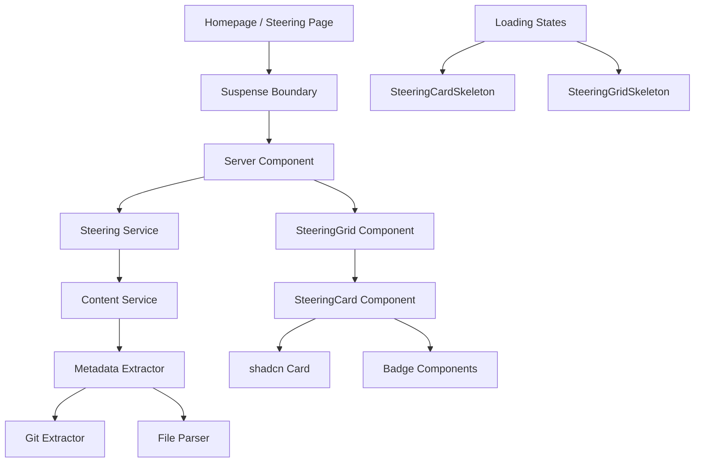

# Design Document

## Overview

This design implements the steering documents rendering feature for promptz.dev, following the established patterns from the existing prompts functionality. The solution leverages Next.js App Router with server components, React Suspense for loading states, and the existing content service architecture with git integration.

The design creates a new steering service that mirrors the prompts service pattern, implements a SteeringCard component following the PromptCard structure, and adds steering sections to both the homepage and a dedicated /steering page. All components use the existing shadcn/ui design system and maintain consistency with the current codebase architecture.

## Architecture

The feature follows the established three-layer architecture:

1. **Data Layer**: Steering service (`lib/steering.ts`) that wraps the content service
2. **Component Layer**: SteeringCard and SteeringGrid components with loading states
3. **Page Layer**: Homepage integration and dedicated steering page with Suspense boundaries

The architecture leverages the existing content service infrastructure, which already handles steering document extraction through `extractSteeringMetadata`, git integration, and React cache memoization.



## Components and Interfaces

### SteeringCard Component

The SteeringCard component follows the exact structure of PromptCard, ensuring visual consistency:

```typescript
interface SteeringCardProps {
  steering: SteeringDocument
  className?: string
}

export function SteeringCard({ steering, className }: SteeringCardProps)
export function SteeringCardSkeleton({ className }: { className?: string })
```

**Component Structure:**
- **Card Header**: Document title and badges (content type + library source)
- **Card Content**: Document ID and author information
- **Card Footer**: Creation date and git commit hash (when available)

**Badge Configuration:**
- Content type badge: "steering" with outline variant (following existing badge utils)
- Library source badge: "promptz" or "kiro-powers" with appropriate styling

### SteeringGrid Component

The SteeringGrid component mirrors the PromptsGrid implementation:

```typescript
interface SteeringGridProps {
  steering: SteeringDocument[]
  maxItems?: number
  className?: string
}

export function SteeringGrid({ steering, maxItems, className }: SteeringGridProps)
export function SteeringGridSkeleton({ count, className }: { count: number, className?: string })
```

**Grid Layout:**
- Responsive CSS Grid with auto-fit columns
- Minimum column width of 320px for optimal card display
- Consistent gap spacing matching existing grid components

### Steering Service

The steering service follows the prompts service pattern exactly:

```typescript
// lib/steering.ts
export const getAllSteering = cache(async (): Promise<SteeringDocument[]>)
export const getLatestSteering = cache(async (limit?: number): Promise<SteeringDocument[]>)
```

**Service Features:**
- Combines steering documents from all libraries (promptz and kiro-powers)
- Sorts by creation date (newest first) using git dates when available
- Implements React cache for request-level memoization
- Graceful error handling with empty array fallbacks

## Data Models

The feature uses the existing `SteeringDocument` interface from the content types:

```typescript
interface SteeringDocument extends BaseContent {
  type: 'steering'
  content: string
  category?: string
}

interface BaseContent {
  id: string           // Generated from library/type/filename
  title: string        // From frontmatter or filename
  author: string       // From frontmatter or git history
  date: string         // From frontmatter or git commits
  path: string         // File system path
  git?: GitInfo        // Git metadata when available
}
```

**Data Flow:**
1. Content service scans library directories for .md files
2. Metadata extractor processes YAML frontmatter and git history
3. Steering service aggregates and sorts documents
4. Components receive typed SteeringDocument objects

## Correctness Properties

*A property is a characteristic or behavior that should hold true across all valid executions of a system-essentially, a formal statement about what the system should do. Properties serve as the bridge between human-readable specifications and machine-verifiable correctness guarantees.*

After analyzing the acceptance criteria, I've identified several properties that can be consolidated to eliminate redundancy:

**Property Reflection:**
- Properties 1.2, 2.2, and 7.3 all test the same sorting logic and can be combined
- Properties 1.3 and 2.3 test the same date precedence logic and can be combined  
- Properties 3.2, 3.3, 3.4, 3.5 test different aspects of card rendering and should remain separate
- Properties 4.1, 4.2, 4.3, 4.4, 4.5 test different badge aspects and should remain separate
- Property 7.2 tests library aggregation which is unique
- Property 7.4 tests limit parameter which is unique

**Property 1: Steering document sorting consistency**
*For any* collection of steering documents, when sorted by creation date, the system should return documents in newest-first order, using git creation date when available and falling back to frontmatter date otherwise
**Validates: Requirements 1.2, 1.3, 2.2, 2.3, 7.3**

**Property 2: Latest steering limit behavior**
*For any* positive integer limit and collection of steering documents, the getLatestSteering function should return exactly that number of documents (or all available if fewer exist)
**Validates: Requirements 1.2, 7.4**

**Property 3: Library aggregation completeness**
*For any* set of libraries containing steering documents, the getAllSteering function should include documents from all available libraries
**Validates: Requirements 2.1, 7.2**

**Property 4: SteeringCard title display**
*For any* steering document, the rendered SteeringCard should display the document title in the card header
**Validates: Requirements 3.2**

**Property 5: SteeringCard metadata display**
*For any* steering document, the rendered SteeringCard should display the document ID and author in the card content
**Validates: Requirements 3.3**

**Property 6: SteeringCard git information display**
*For any* steering document with git information, the rendered SteeringCard should display the commit hash in the card footer
**Validates: Requirements 3.4**

**Property 7: SteeringCard date display**
*For any* steering document, the rendered SteeringCard should display the creation date in the card footer
**Validates: Requirements 3.5**

**Property 8: SteeringCard content type badge**
*For any* steering document, the rendered SteeringCard should display a "steering" badge with outline variant
**Validates: Requirements 4.1, 4.5**

**Property 9: SteeringCard library source badge**
*For any* steering document, the rendered SteeringCard should display a library source badge matching the document's origin library
**Validates: Requirements 4.2**

**Property 10: Badge utility consistency**
*For any* SteeringCard, the badges should be styled using the existing badge utility functions and arranged according to the card-header pattern
**Validates: Requirements 4.3, 4.4**

**Property 11: Git information preservation**
*For any* steering document with available git metadata, the processed document should retain all git information fields
**Validates: Requirements 6.3**

<function_calls>
<invoke name="prework">
<parameter name="featureName">steering-docs-display

## Error Handling

The feature implements comprehensive error handling following the established patterns:

**Service Level Error Handling:**
- All service functions wrap operations in try-catch blocks
- Errors are logged with context but don't propagate to UI
- Empty arrays returned on failure to prevent page crashes
- React cache ensures failed requests don't cascade

**Component Level Error Handling:**
- Suspense boundaries provide fallback UI during loading
- Skeleton components match actual component structure
- Graceful degradation when data is missing or malformed
- Error boundaries can be added at page level if needed

**Data Processing Error Handling:**
- Invalid steering documents are filtered out during processing
- Missing metadata fields use placeholder values
- Git extraction failures don't prevent document display
- File system errors are caught and logged

## Testing Strategy

The testing approach follows the established dual testing pattern:

**Unit Tests:**
- Test specific examples and edge cases for each component
- Verify error handling scenarios (empty data, missing files)
- Test component rendering with various data configurations
- Validate service functions with known inputs
- Test badge utility integration and styling

**Property-Based Tests:**
- Verify universal properties across all inputs using Jest and @fast-check/jest
- Test sorting behavior with randomly generated document sets
- Validate card rendering properties with generated steering documents
- Test limit parameter behavior with various values
- Verify library aggregation with different library configurations

**Property Test Configuration:**
- Minimum 100 iterations per property test
- Each test tagged with: **Feature: steering-docs-display, Property {number}: {property_text}**
- Tests focus on core business logic and data transformations
- UI properties tested through component rendering validation

**Integration Testing:**
- Test complete data flow from content service to component rendering
- Verify Suspense boundary behavior with async data loading
- Test responsive grid layout at different screen sizes
- Validate SEO metadata generation for steering page

The testing strategy ensures both specific behavior validation through unit tests and comprehensive correctness verification through property-based testing, providing confidence in the feature's reliability across all possible inputs and scenarios.